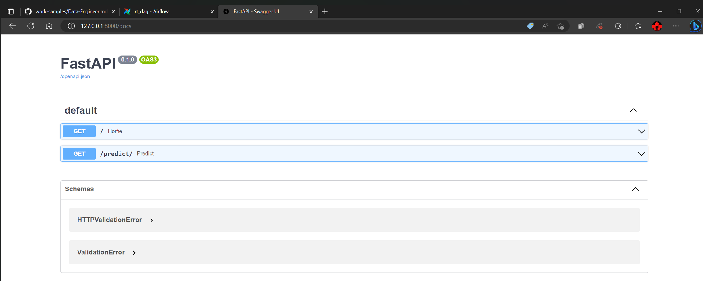
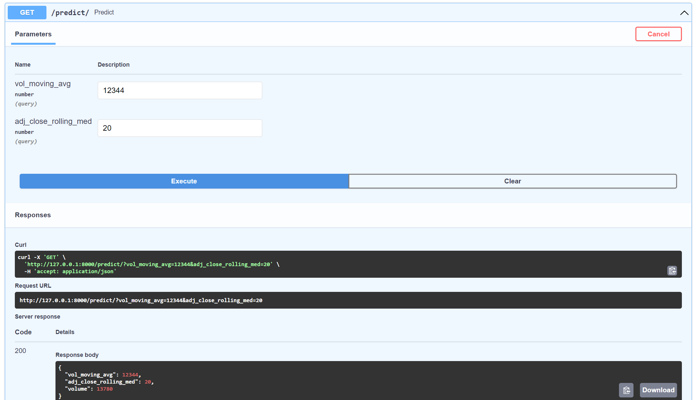

# ETL_ML Pipeline using Airflow

Implementing a data pipeline using Airflow in a docker container. Airflow is a DAG (Directed Acyclic Graph) oriented tool. that can help streamline data processing and management with tracking data lineage, ensuring data integrity, and minimizing errors during processing.

## End to End Implementation

### 1. Docker Setup
Various components of Airflow (scheduler, trigger, webserver, etc.) are run on separate containers. 

Downloading the docker compose file for airflow

    curl -LfO "https://airflow.apache.org/docs/apache-airflow/stable/docker-compose.yaml"

Booting up the docker containers

    docker-compose up

 Building an extending airflow image to install dependencies

    docker build . --no-cache --tag extending_airflow:latest
    
### 2. Airflow Orchestration

Using the airflow Web UI to orchestrate the data pipeline.

Accessing the Airflow Web UI

    http://localhost:8080/

DAG Structure

.png)

DAGs can be executed by manual trigger or scheduled trigger

.png)

### 3. Task Explanation
**Preprocessing**
1.  Downloading the ETF and stock datasets from the primary dataset available at  [https://www.kaggle.com/datasets/jacksoncrow/stock-market-dataset](https://www.kaggle.com/datasets/jacksoncrow/stock-market-dataset).
2.  Setting up a data structure to retain all data from ETFs and stocks with the following columns.
    
    ```
    Symbol: string
    Security Name: string
    Date: string (YYYY-MM-DD)
    Open: float
    High: float
    Low: float
    Close: float
    Adj Close: float
    Volume: A suitable Number type (int or float)
    
    ```
    
3.  Converting the resulting dataset into a structured format (Parquet).

**Feature Engineering**

1.  Calculating the moving average of the trading volume (`Volume`) of 30 days per each stock and ETF `vol_moving_avg`.

2.  Similarly, calculating the rolling median `adj_close_rolling_med`.

3.  Retaining the resulting dataset (parquet format) in a separate directory.

**Model Training**

1.  Integrating the Machine Learning training process as a part of the data pipeline.
2.  Saving the resulting model (pickle file) to disk.
3.  Persisting training metrics, such as loss and error values as log files.
4. Model Implementation - `LightGBMRegressor`

	Advantages of using `LightGBM` over `RandomForest` - *Faster training speed and higher efficiency, Lower memory usage, better accuracy than any other boosting algorithm.*

### 4. API Deployment

Building an API service using [FastAPI](https://fastapi.tiangolo.com/) to serve the trained predictive model. FastAPI is a modern, fast (high-performance), web framework for building APIs. The API is hosted using [Uvicorn](https://www.uvicorn.org/) web server.

Accessing the FastAPI Web UI

    http://127.0.01:8000/
Accessing the Swagger UI

    http://127.0.01:8000/docs



  An  `/predict`  API endpoint which takes two values,  `vol_moving_avg`  and  `adj_close_rolling_med`, and responds with an integer value that represents the trading volume.
     
    GET /predict?vol_moving_avg=12345&adj_close_rolling_med=25
    -> 10350

    	
## Next Steps
1. Storing the data in a database will improve accessibility and processing speed.
2. Improving the performance of Airflow by deploying it in a cluster of machines hosted on cloud (AWS/ Azure/ GCP).
3. Using an Ensemble of Machine Learning models and choosing the best model to get better predictions.
4. Deploying the API on cloud which enables handling more requests and better provisioning of computing resources.

### References:

1. [Increasing Processing Speed of Airflow](https://stackoverflow.com/questions/48219314/can-i-increase-the-processing-speed-by-adding-more-cpus-to-operators-in-airflow)
2. [Improving the performance of LightGBM model](https://lightgbm.readthedocs.io/en/latest/Parameters.html)
3. [Installing Dependencies for LightGBM installation on Docker](https://stackoverflow.com/questions/55036740/lightgbm-inside-docker-libgomp-so-1-cannot-open-shared-object-file)
4. [Super user priviledge to install dependencies](https://github.com/SeleniumHQ/docker-selenium/issues/725)
5. [Improving Parellelism in Airflow](https://www.astronomer.io/blog/7-common-errors-to-check-when-debugging-airflow-dag/)
6. [Mapping Local Directory to Docker Volumes](https://stackoverflow.com/questions/70749725/how-do-we-map-a-specific-local-directory-on-apache-airflow-docker-volumes)
7. [Importing Modules in Python](https://towardsdatascience.com/understanding-python-imports-init-py-and-pythonpath-once-and-for-all-4c5249ab6355)
8.  [Forcing Docker clean image build](https://stackoverflow.com/questions/35594987/how-to-force-docker-for-a-clean-build-of-an-image)
9. [Missing DAG in Airflow UI](https://stackoverflow.com/questions/58319767/how-fix-dag-seems-to-be-missing)
10. [Creating File Name with current data and time](https://stackoverflow.com/questions/10607688/how-to-create-a-file-name-with-the-current-date-time-in-python) 
11. [Pickle EOF Error](https://stackoverflow.com/questions/24791987/why-do-i-get-pickle-eoferror-ran-out-of-input-reading-an-empty-file)
12. [FastAPI import Error](https://stackoverflow.com/questions/71119413/fastapi-error-cannot-import-name-fastapi-from-fastapi)
13. [Pandas Dataframe to Parquet file](https://stackoverflow.com/questions/41066582/python-save-pandas-data-frame-to-parquet-file)


